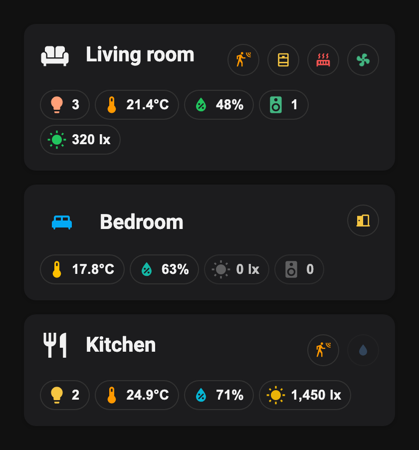

# Advanced Area Card

A Home Assistant dashboard card that summarises one or more **areas** at a glance: area icon and name, live summary chips (lights, temperature, humidity, music, lux) and rule-based activity indicators (motion, doors, windows, heating, fans, …).



- **Zero dependencies**, one JavaScript file, no build step.
- Resolves entities through the **area, device and entity registries**: add a light to the area in Home Assistant and the chip updates by itself.
- **Visual editor** — everything below can be configured from the dashboard "Add card" dialog, no YAML needed.
- Follows your Home Assistant theme (light / dark) and works with `card-mod`.
- Only re-renders when an entity the card actually watches changes.

## Installation

### HACS (recommended)

[](https://my.home-assistant.io/redirect/hacs_repository/?owner=riaan&repository=advanced-area-card&category=plugin)

1. In Home Assistant open HACS → ⋮ (top right) → **Custom repositories**.
2. Add `https://github.com/riaan/advanced-area-card` with category **Dashboard**, then **Add**.
3. Search for *Advanced Area Card* in HACS → **Download**. HACS adds the dashboard resource for you.
4. Hard refresh the browser (clear the app cache in the mobile companion app).

### Manual

1. Download `advanced-area-card.js` from the [latest release](https://github.com/riaan/advanced-area-card/releases/latest) (or from `dist/`) and copy it to `/config/www/advanced-area-card.js`.
2. Settings → Dashboards → ⋮ → **Resources** → Add resource
   URL `/local/advanced-area-card.js?v=1`, type **JavaScript module**. (Enable *Advanced mode* in your user profile if you don't see Resources.)
3. Hard refresh the browser. Bump `?v=` after every update.

### Updating

HACS shows an update when a new release is published here. Download it from HACS, then hard refresh the browser (or clear the app cache on mobile) so the new file is loaded.

## Adding the card

Edit dashboard → **Add card** → search **Advanced Area**. Pick one or more areas, then add chips and activity indicators in the editor.

## Features

### Header

- Area **icon and name** taken from the area registry. Override either with `icon` / `title`.
- **Multiple areas** in one card (`areas`): chips and indicators combine all selected areas, the name and icon come from the first one unless overridden.
- `icon_style`: `plain` or `boxed`.
- Card-level `tap_action` and `hold_action` (`more-info`, `navigate`, `url`, `toggle`, `call-service`, `assist`, `none`).

### Summary chips

| Chip          | Shows                                                                          | Colour                                          |
| ------------- | ------------------------------------------------------------------------------ | ----------------------------------------------- |
| `lights`      | number of lights that are `on`                                                 | active / inactive colour, or the average light colour (`use_light_color`) |
| `temperature` | average of temperature sensors and `climate` entities with `current_temperature` | threshold colours and icons, unit conversion    |
| `humidity`    | average of humidity sensors and `climate` entities with `current_humidity`     | threshold colours and icons                     |
| `music`       | number of media players that are `playing`, `buffering` or `on`                | active / inactive colour                        |
| `lux`         | average of illuminance sensors                                                 | threshold colours and icons                     |

Per chip you can:

- reorder it and override its **icon**;
- choose between **all matching entities in the area** and a **custom entity list** (`use_custom_entities`, `entity_ids`);
- set **tap** and **hold** actions (default: more-info);
- **hide it when zero** (lights, music, lux — `hidden_when_zero`);
- override the **active / inactive colours** (lights, music);
- edit the **threshold table** (value → colour → optional icon) for temperature, humidity and lux. Sensible defaults are built in.

### Activity indicators

Small icons in the top-right that appear when something is going on. Each indicator is driven by a **rule**, so it can do much more than "entity is on".

- **Smart defaults** from the entity picked in the editor: binary sensor device classes (motion, door, window, moisture, smoke, gas, CO, plug, power, …), lights, switches, fans (spinning icon), media players, cameras, vacuums, covers, weather, climate (heating / cooling), locks, persons / device trackers and numeric sensors.
- **Rules** (`when`, plus extra `and_if` conditions):
  - `state` — operators `eq`, `ne`, `in`, `not_in`, `contains`, `matches`, `truthy`, `falsy`
  - `numeric` — `gt`, `gte`, `lt`, `lte` on the state or an attribute
  - `time` — only between `after` and `before` (HH:MM)
  - `and` / `or` / `not` — combine rules
  - several entities per rule with aggregation `any`, `all`, `none`, `sum`, `avg`, `min`, `max`, `count`, `first`
  - `for` / `for_duration` — only show after the condition has held for N seconds
- **Display**: icon, colour, size and icon size, animation (`none`, `pulse`, `spin`, `blink`, `bounce`, `shake`, with speed), a badge with text and colour, a tooltip, and what to do when inactive (`hide`, `dim` with opacity, or `show`).
- **Display overrides** — change icon, colour, animation, … depending on the value, e.g. a fan that spins faster with its percentage or a temperature sensor that turns red above 25 °C.
- Tooltip and badge text support `{{entity}}`, `{{state}}`, `{{value}}` and `{{attr.name}}`.
- Tap and hold actions per indicator, reorderable in the editor.

### Styling

Under `styling` you can hide the title or icon, set their colours and tweak sizes and spacing in pixels: title size, icon size, chip margin / gap / padding / min width / radius / icon and text size, indicator gap / size / radius / icon size. Anything you leave empty uses the built-in default.

## Configuration

Use the visual editor for anything beyond the basics. A minimal YAML configuration:

```yaml
type: custom:advanced-area-card
areas:
  - woonkamer
chips:
  - type: lights
  - type: temperature
  - type: humidity
  - type: music
  - type: lux
    hidden_when_zero: true
activity_indicators:
  - name: Movement
    when:
      type: state
      entity_id: binary_sensor.living_room_motion
      operator: in
      value: ["on", "detected"]
    display:
      icon: mdi:motion-sensor
      color: "#ff9800"
```

A fan that spins faster as the speed goes up:

```yaml
activity_indicators:
  - name: Fan
    when:
      type: state
      entity_id: fan.living_room
      operator: eq
      value: "on"
    display:
      icon: mdi:fan
      color: "#43b581"
      animation: spin
      display_overrides:
        - match: { entity_id: fan.living_room, attribute: percentage, operator: gte, value: 66 }
          animation_speed: 3
```

### Card options

| Option                | Description                                                          |
| --------------------- | -------------------------------------------------------------------- |
| `areas`               | List of area ids. (A single `area: id` from older configs still works.) |
| `title`, `icon`       | Override the area name / icon.                                       |
| `icon_style`          | `plain` (default) or `boxed`.                                        |
| `tap_action`, `hold_action` | Standard Home Assistant action config.                         |
| `chips`               | List of chips, see above.                                            |
| `activity_indicators` | List of indicators, see above.                                       |
| `styling`             | Sizes, colours and visibility of title and icon, chips and indicators. |

## Troubleshooting

- **Card not in the picker** — hard refresh; check the resource is listed under Settings → Dashboards → Resources as *JavaScript module*.
- **A chip shows `--`** — no matching entity is in the area (or in the custom list). Assign the entities or their device to the area in Home Assistant.
- **Console banner** — the browser console prints `ADVANCED-AREA-CARD <version>` when the file is loaded; include it in bug reports.

## Development

```bash
npm install
npm run lint
npm run check:version -- v1.0.0   # release tag vs VERSION in the JS and CHANGELOG
```

The shipped file is `dist/advanced-area-card.js`. HACS reads releases, so the release tag (`v1.0.0`) must match `const VERSION = "1.0.0"` in that file.

## License

[MIT](LICENSE)
